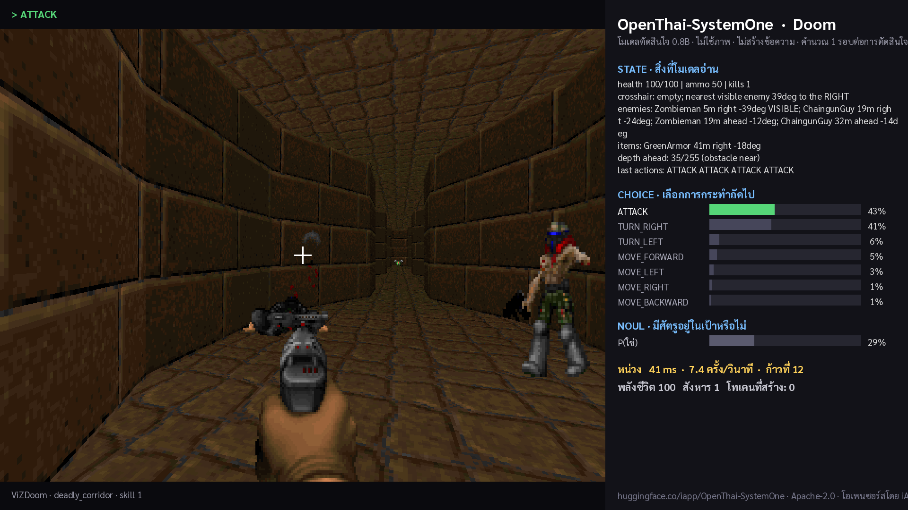

# OpenThai-SystemOne plays Doom

A tiny open **decision model** (0.8B, no text generation, no vision) controlling Doom in real time, on your own machine.



Every step, the game's symbolic state (health, ammo, enemies with distance and bearing, wall depth, last actions) is sent
as **text** to [OpenThai-SystemOne](https://huggingface.co/iapp/OpenThai-SystemOne), which answers two typed questions in
**one forward pass**: which of the 7 actions to take (`choice`, with a probability per action) and whether an enemy is
in the crosshair (`noul`). The chosen action is pressed, the HUD shows what the model read and what it answered.
About 40 ms per decision on a GPU, 0 output tokens.

The same three question types (`choice` / `score` / `noul`) route support tickets, moderate comments and pick UI
actions for agents; Doom is just the fastest way to *see* a decision model think.

## Run it (2 minutes)

```bash
git clone https://github.com/iapp-technology/openthai-systemone-doom && cd openthai-systemone-doom
python -m venv .venv && source .venv/bin/activate          # Windows: .venv\Scripts\activate
pip install -r requirements.txt opencv-python              # opencv = live HUD window
```

**Option A — use the iApp API (no GPU needed).** Register at [iapp.co.th](https://iapp.co.th), create an API key, then:

> Status: the `openthai/systemone` route on api.iapp.co.th is being enabled; until it is live, use Option B or C.

```bash
export IAPP_API_KEY=iapp_live_xxxxxxxxxxxxxxxx
python play_doom.py                                        # deadly corridor, live window; q to quit
python play_doom.py --scenario defend_the_center --lang th --record clip.mp4
```

Over the internet each decision takes ~150–300 ms; use `--tics 6` if the marine reacts too slowly.

**Option B — run the open weights locally** (NVIDIA GPU or Apple Silicon):

```bash
pip install "git+https://github.com/iapp-technology/openthai-systemone"
python play_doom.py --backend local --model iapp/OpenThai-SystemOne
```

**Option C — your own server** that speaks the same `POST /v1/systemone` contract:

```bash
python play_doom.py --backend url --url http://localhost:8000/v1/systemone
```

## Scenarios

`deadly_corridor` (default) · `defend_the_center` · `defend_the_line` · `health_gathering` · `basic` · `my_way_home` · `take_cover`
(all ship with ViZDoom). `--skill 1..5`, `--seed N`, `--lang en|th` for the HUD language, `--seconds 60` to stop
automatically, `--record out.mp4` to save a clip (needs `ffmpeg`), `--no-window` for headless use.

## What the model actually sees

```text
health 100/100 | ammo 50 | kills 1
crosshair: empty; nearest visible enemy 39deg to the RIGHT
enemies: Zombieman 5m right -39deg VISIBLE; ChaingunGuy 19m right -24deg; Zombieman 19m ahead -12deg
items: GreenArmor 41m right -18deg
depth ahead: 35/255 (obstacle near)
last actions: ATTACK ATTACK ATTACK ATTACK
```

plus one instruction sentence per scenario (the rules of the game, in plain language) and the 7 action names with
descriptions. No game-specific training: the model was never shown Doom. Everything it does comes from reading the
state and the option descriptions. The request/response format is the same as TypeSafe's `/v1/systemone` (Jev), so
this harness also works against any System One model.

## Files

- `play_doom.py` — the whole demo (state serialisation, model call, HUD, optional recording)
- `fonts/` — Sarabun (OFL) for the Thai HUD

## Credits

Model: [iapp/OpenThai-SystemOne](https://huggingface.co/iapp/OpenThai-SystemOne) by iApp Technology / OpenThaiGPT, Apache-2.0.
Game: [ViZDoom](https://github.com/Farama-Foundation/ViZDoom). Inspired by TypeSafe AI's Jev Doom demo and NanoJev.
